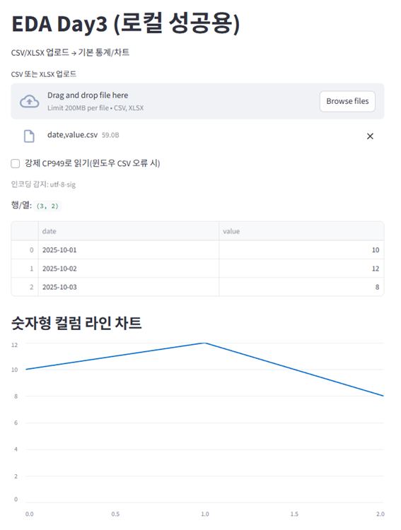

👉 [실행하기(배포)](https://project-eda-dashboard-mdymcubfvmcmtygcqisq98.streamlit.app/)


# 공개데이터 EDA 대시보드
👉 [실행하기(배포)](https://project-eda-dashboard-mdymcubfvmcmtygcqisq98.streamlit.app/) · [프로필](https://github.com/cxo-ca)


공개데이터 EDA → 출퇴근 피크 시각화, 핵심 지표 3개 정의
data-analysis, streamlit, python, dashboard

EDA: Public data EDA → peak commute visualization, 3 key metrics

## 실행 방법
```bash
pip install -r requirements.txt
streamlit run app/app.py

## 결과
- CSV/XLSX 업로드 → 자동 인코딩 감지(utf-8/cp949 등), 핵심 지표/차트 **즉시 표시**
